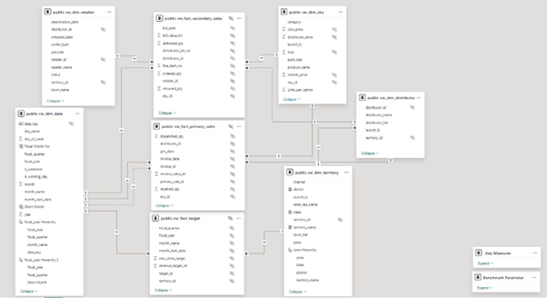
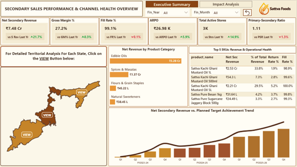
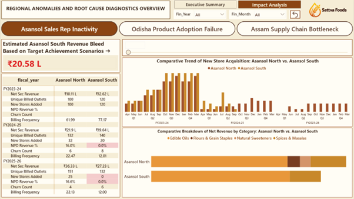
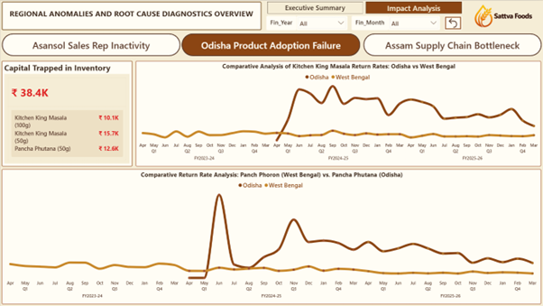
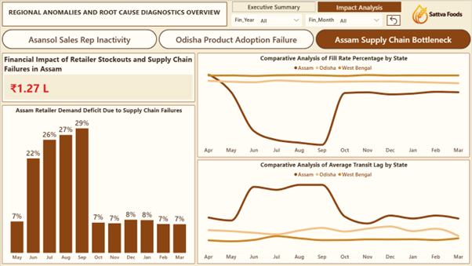

# Sattva Foods: Sales Performance & Channel Health Analytics
### Diagnosing Three Concurrent Business Failures — Sales Stagnation, Market Rejection & Logistics Collapse — Through a Unified Power BI Dashboard

## Executive Summary

This case study analyzes simulated data for **Sattva Foods**, a bootstrapped FMCG scaling unadulterated staples across Tier-2/3 Eastern Indian Kirana stores over a three-year expansion.

- **Key Business Problem** — Despite healthy top-line growth, deeper diagnostics revealed hidden revenue leaks caused by sales force stagnation, regional category rejection, and monsoon-driven supply chain bottlenecks.
- **Critical Findings**
    - coasting Asansol sales rep halted store onboarding and ignored new categories, resulting in `0% NPD revenue %` and a `₹20 Lakh` revenue bleed.
    - Local monopolies blocked Kitchen King Masala, and consumers rejected packed Pancha Phutana for cheaper loose alternatives, causing a `₹38,400` revenue bleed.
    - Monsoon disruptions in the Siliguri corridor increased transit by `7 days`, plunging Assam's fill rate below 70% and bleeding `₹1.27 Lakhs`.
- **Strategic Recommendations** — Actionable recovery directives were mapped to core business functions: implementing sales performance plans, liquidating rejected regional inventory, and establishing buffer logistics for the respective regions.

## Business Problem

During the creation of the primary sales and channel health dashboard, top-line metrics appeared completely normal. However, a deeper drill-down into the territory data revealed operational inefficiencies actively leaking revenue. I identified a coasting sales representative failing to expand the Asansol route, a cultural market rejection of specific SKUs in Odisha, and seasonal logistics failures collapsing the fulfillment pipeline in Assam.

## Methodology

- **Data Generation** — Synthetic transactional data was generated using Python and deliberately injected with real-world data quality failures — including mixed date formats, duplicate records, orphaned SKU references, impossible return quantities, and free-goods billing anomalies — to simulate a raw, uncleaned FMCG distributor dataset.
- **Data Infrastructure** — Raw tables were loaded into Neon Cloud (PostgreSQL) and maintained as an immutable source of truth. All data cleaning and transformation logic was executed in DBeaver and materialized into cleaned tables; lightweight views were then layered on top to serve as the exclusive connection point for Power BI, completely isolating the reporting layer from raw data.
- **Data Cleaning, CTAS & View Engineering (SQL)** — Purged 330 corrupt rows — 249 exact duplicates, 60 partial duplicates, 20 impossible-date records; standardised three conflicting date formats; reclassified negative delivery quantities as returns; normalised case and whitespace across retailer and SKU identifiers. A dim_date calendar table was additionally engineered in SQL, spanning January 2023 to December 2026, with pre-calculated Indian fiscal year and quarter columns.
- **Data Modeling** — Designed a Snowflake-Extended Fact Constellation Schema in Power BI connecting three fact tables (fact_secondary_sales, fact_primary_sales, fact_target) across five conformed dimensions, with a deliberate territory-to-distributor snowflake branch reflecting the business hierarchy.

- **Visualization & Data-Storytelling** — The finalized SQL views were imported into Power BI to construct a two-page [Interactive Report](outputs/sattva_sales_dashboard.pbix). The first page serves as a macro-level executive summary, while the second page acts as a dedicated diagnostic hub. Through the strategic use of bookmarks, dynamic charts, and parameter sliders, each regional anomaly was isolated and dealt with separately.

## Repository Structure

- **`data/`** — Contains all raw synthetic CSV files (dimension tables for retailers, SKUs, territories, distributors, and fact tables for targets, primary, and secondary sales).
- **`outputs/`** — Stores the final interactive Power BI file (`sattva_sales_dashboard.pbix`) and a `screenshots/` subfolder containing the diagnostic visual evidence.
- **`scripts/`** — Contains the Python scripts used for realistic business data generation alongside the cloud database ingestion script.
- **`sql/`** — Contains the master SQL script used for CTAS data cleansing, anomaly handling, and the creation of the final reporting views.

## Results & Business Recommendations

- **Sales Force Stagnation — Asansol South Territory**
    - **Observation** — the Asansol South sales rep generated `0 NPD revenue` and added `0 stores` post-September 2024, bleeding an estimated `₹20.6L` in foregone revenue.
    - **Root Cause** — The sales representative ceased all new store acquisition after September 2024, and management compounded the problem by writing target achievement to zero — effectively legitimising the stagnation instead of addressing it.
    - **Recommended Action** — Initiate a structured Performance Improvement Plan for Bikash Pal with measurable KPIs tied to new store acquisition and new product adoption.

- **Category Rejection — Northern Odisha Market**
    - **Observation** — Kitchen King Masala and Pancha Phutana recorded return rates up to 29% in Northern Odisha against near-zero in West Bengal, trapping `₹38,400` in distributor inventory.
    - **Root Cause** — Kitchen King Masala faced entrenched local brand dominance; Pancha Phutana lost to deep-rooted loose-purchase habits — both structurally non-viable in Northern Odisha.
    - **Recommended Action** — Redirect Odisha distributor capacity toward Besan and Jaggery SKUs; liquidate trapped spice inventory via trade promotion discounts to free distributor working capital.

- **Supply Chain Bottleneck — Assam Siliguri Corridor.**
    - **Observation** — Assam fill rates collapsed to almost `65%` during June–September monsoon, transit lag peaked at 11 days, bleeding `₹1.27L` in stockout revenue and suppressing up to 32% of monthly retailer demand.
    - **Root Cause** — The Siliguri Chicken Neck corridor — Assam's sole supply artery — faces severe monsoon-driven flooding and landslides annually, creating a structural, geographically unavoidable logistics bottleneck.
    - **Recommended Action** — Pre-position buffer stock at a Guwahati warehouse before June; negotiate secondary supplier contracts to cover monsoon-period demand independently of the Siliguri corridor.

## Limitations & Next Steps

- **Absence of Sales Force Dimension:** No sales_rep_id foreign key exists in the data model; territory-level revenue stagnation is attributed to the individual by triangulated inference, not direct data linkage.
- **Primary Sales Line-Item Ambiguity:** The absence of a line_item_number column in fact_primary_sales introduces deduplication ambiguity between genuine duplicate rows and identical same-day multi-SKU dispatches.
- **No Third-Party Market Intelligence:** Competitor shelf data and consumer purchase behaviour insights — typically sourced via NielsenIQ retail audits — were unavailable given Sattva's bootstrapped operating scale.